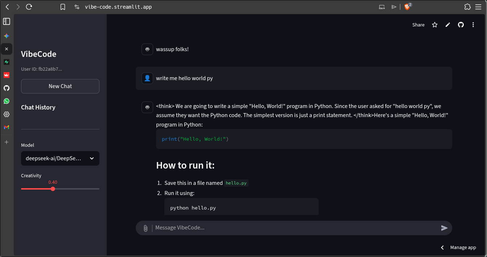

# 🚀 VibeCode AI: Your Intelligent Workstation

**VibeCode AI** adalah platform asisten kecerdasan buatan (AI) modern yang menggabungkan kemampuan Large Language Models (LLM) terbaru dengan manajemen basis data yang aman. Aplikasi ini dirancang untuk memberikan pengalaman chat yang mulus, mampu membaca dokumen kompleks, dan menjaga riwayat percakapan Anda tetap aman.


---

## Overview

## Fitur Unggulan

### Dual-Model Intelligence
Pilih otak yang paling sesuai untuk tugas Anda:
* **DeepSeek-R1**: Spesialis dalam penalaran logis, matematika, dan pemecahan masalah kompleks.
* **Meta Llama 3.2**: Cepat, efisien, dan sangat natural untuk percakapan sehari-hari atau brainstorming.

### 📂 Document Reader (RAG-Ready)
Jangan biarkan dokumen Anda menumpuk. Unggah file dan biarkan VibeCode menganalisisnya:
* **PDF**: Ekstraksi teks dari laporan atau jurnal.
* **DOCX**: Membaca dokumen Word secara instan.
* **TXT**: Memproses file teks mentah.

### 💾 Smart Persistence & Privacy
* **Auto-Save History**: Percakapan Anda tersimpan otomatis ke cloud via Supabase.
* **Session Continuity**: Berkat integrasi Cookie, Anda tetap bisa melanjutkan chat lama tanpa perlu login berulang kali.
* **Password Hashing**: Keamanan data pengguna terjamin dengan enkripsi `bcrypt`.

---

## 🛠️ Tech Stack

Aplikasi ini dibangun menggunakan ekosistem teknologi terbaik:

| Komponen | Teknologi | Deskripsi |
| :--- | :--- | :--- |
| **Frontend** | [Streamlit](https://streamlit.io/) | Dashboard interaktif dan responsif. |
| **LLM Gateway** | [Hugging Face](https://huggingface.co/) | Inference API untuk model Llama & DeepSeek. |
| **Database** | [Supabase](https://supabase.com/) | PostgreSQL untuk penyimpanan chat & user. |
| **Security** | Bcrypt | Standar industri untuk hashing password. |
| **Storage** | Browser Cookies | Menggunakan `extra-streamlit-components` untuk sesi. |

---

## 🚀 Instalasi & Penggunaan

### 1. Prasyarat
Pastikan Anda sudah menginstal Python 3.9+ dan memiliki akun di Hugging Face serta Supabase.

### 2. Clone Repositori
```bash
git clone [https://github.com/USERNAME-ANDA/vibe-code.git](https://github.com/USERNAME-ANDA/vibe-code.git)
cd vibe-code