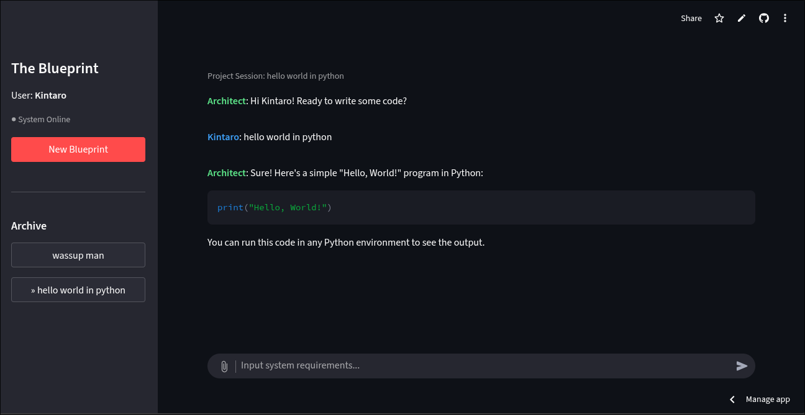

# 🚀 VibeCode AI: Your Intelligent Workstation

**VibeCode AI** is a modern artificial intelligence (AI) assistant platform that combines the power of the latest Large Language Models (LLMs) with secure database management. This application is designed to provide a seamless chat experience, capable of reading complex documents and keeping your conversation history secure.

---

## 🏗️ Overview



VibeCode AI serves as a bridge between your local documents and powerful cloud-based AI models, ensuring that architectural blueprints and coding requirements are handled with senior-level precision.

### ✨ Key Features

* **Dual-Model Intelligence**: Choose the "brain" that best suits your task:
    * **DeepSeek-R1**: Specialized in logical reasoning, mathematics, and complex problem-solving.
    * **Meta Llama 3.2**: Fast, efficient, and highly natural for daily conversations or brainstorming.
* **📂 Document Reader (RAG-Ready)**: Don't let your documents pile up. Upload files and let VibeCode analyze them:
    * **PDF**: Text extraction from reports or journals.
    * **DOCX**: Instant reading of Word documents.
    * **TXT**: Processing of raw text files.
* **💾 Smart Persistence & Privacy**:
    * **Auto-Save History**: Your conversations are automatically saved to the cloud via Supabase.
    * **Session Continuity**: Continue old chats without needing to log in repeatedly.
    * **Password Hashing**: User data security is guaranteed with `bcrypt` encryption.

---

## 🛠️ Tech Stack

This application is built using a top-tier technology ecosystem:

| Component | Technology | Description |
| :--- | :--- | :--- |
| **Frontend** | [Streamlit](https://streamlit.io/) | Interactive and responsive dashboard. |
| **LLM Gateway** | [Hugging Face](https://huggingface.co/) | Inference API for Llama & DeepSeek models. |
| **Database** | [Supabase](https://supabase.com/) | PostgreSQL for chat and user storage. |
| **Security** | Bcrypt | Industry standard for password hashing. |
| **Storage** | Browser Cookies | For seamless session management. |

---

## 🚀 Installation & Usage

### 1. Prerequisites
* Python 3.9+
* Hugging Face API Token
* Supabase Project URL & API Key

### 2. Clone Repository
```bash
git clone [https://github.com/YOUR-USERNAME/vibe-code.git](https://github.com/YOUR-USERNAME/vibe-code.git)
cd vibe-code